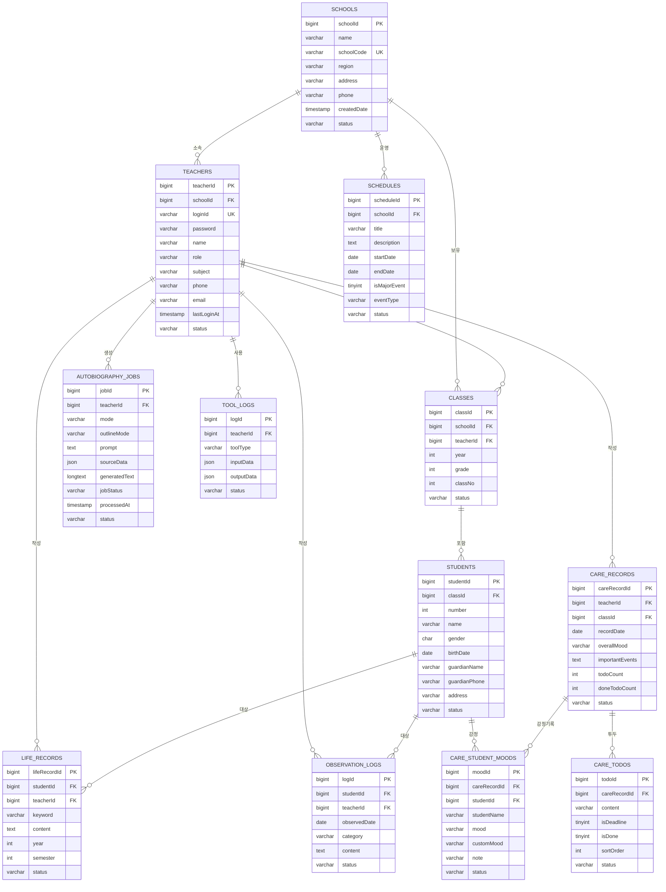

# 온리티칭 ERD — Mermaid 다이어그램

---

## 관계 요약

| Parent | Child | 관계 | 의미 |
|--------|-------|------|------|
| SCHOOLS | TEACHERS | 1:N | 학교에 소속된 교사들 |
| SCHOOLS | CLASSES | 1:N | 학교의 학급들 |
| SCHOOLS | SCHEDULES | 1:N | 학교 학사일정 |
| TEACHERS | CLASSES | 1:N | 담임 교사 |
| TEACHERS | CARE_RECORDS | 1:N | 돌봄교실 일일 기록 |
| TEACHERS | AUTOBIOGRAPHY_JOBS | 1:N | 자서전 생성 작업 |
| CLASSES | STUDENTS | 1:N | 반 → 학생 |
| STUDENTS | LIFE_RECORDS | 1:N | 학생별 생활기록부 |
| STUDENTS | OBSERVATION_LOGS | 1:N | 학생별 관찰일지 |
| STUDENTS | CARE_STUDENT_MOODS | 1:N | 학생별 감정 기록 |
| CARE_RECORDS | CARE_TODOS | 1:N | 일일 기록 → 투두들 |
| CARE_RECORDS | CARE_STUDENT_MOODS | 1:N | 일일 기록 → 학생별 감정들 |
